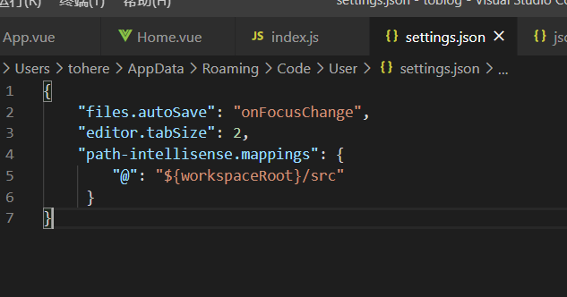
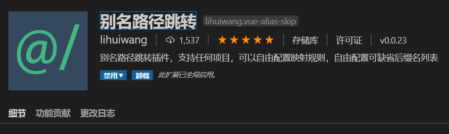

# toblog


## vscode插件

### path-intellisense

> 解决vscode不提示@别名问题
>
> 安装完成后，在setting.json中进行如下配置



```json
"path-intellisense.mappings": {
  "@": "${workspaceRoot}/src"
}
```

> 后不知什么原因不能提示，改用path autocomplete插件
>
> 然后在setting.json中进行如下配置

```json
"path-autocomplete.pathMappings": {
  "@": "${folder}/src"
},
```


### 别名路径跳转

> 解决别名@引入后按住Ctrl+鼠标左键不能跳转的问题




### Auto Close Tab

> 自动闭合标签插件


## 项目用到的插件

### less/less-loader

```shell
npm i -D less less-loader
```

### 配置less全局变量

```shell
npm i -D style-resources-loader
```

在`vue.config.js`中进行如下配置

```javascript
const path = require('path')
function resolve (dir) {
  return path.join(__dirname, dir)
}
module.exports = {
  pluginOptions: { // 第三方插件配置
    'style-resources-loader': {
      preProcessor: 'less',
      patterns: [path.resolve(__dirname, './src/assets/css/vars/index.less')] // less所在文件路径
    }
  }
}
```

> 配置完成后，在main.js中进行引入
>
> 使用时报错undefined，需要安装vue-cli-plugin-style-resources-loader插件
>
> 但是在安装vue-cli-plugin-style-resources-loader插件时出错
>
> 这时采用vue的安装方式: vue add style-resources-loader
>
> 这个时候vue会自动安装style-resources-loader和vue-cli-plugin-style-resources-loader，并且自动添加vue.config.js文件
>
> 配置的话还和上边的配置一样即可


### normalize.css

> css初始化样式

```shell
npm i normalize.css
```

> main.js引入

```shell
import 'normalize.css'
```


### mavonEditor

> markdown解析插件

```shell
npm i mavon-editor
```

> 引入方法：https://github.com/hinesboy/mavonEditor/blob/master/doc/cn/use.md


## axios

```shell
npm i axios
```

## keepAlive中include/exclude的用法问题

> 用法

```html
<keep-alive exclude="Posts,Categories">
  <router-view></router-view>
</keep-alive>
```

**注意：include/exclude中的名字并不是router.js中命名的路由名字，而是对应的组件中export中命名的名字**

> 参考: https://forum.vuejs.org/t/keep-alive-include-router-view/37525/9

## 关于vue+express cookie的一些用法

> 参考: https://www.jianshu.com/p/e5c9162d14e3

